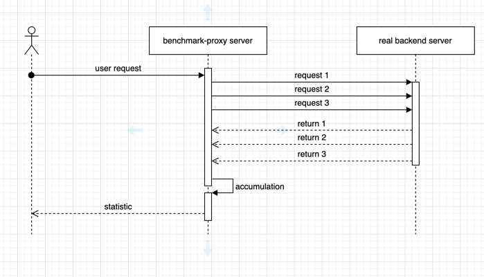

English | [中文](README_ZH.md)

# Overview

A powerful HTTP/HTTPS proxy tool designed for API benchmark testing and performance analysis.

## Key Features

- Full HTTP/HTTPS proxy support
- Comprehensive API benchmark testing capabilities
- Detailed performance metrics tracking (response time, success/error counts)
- Dynamic request data replacement via template tags
- Flexible response validation for both status codes and response bodies

# SSL Certificate Setup (Optional)

For HTTPS support, you can generate self-signed certificates using the following commands:

1. `openssl genrsa -out ca.key 2048`
2. `openssl req -new -x509 -key ca.key -out ca.crt -days 1095`
3. `mv ca.* resources/`
4. Add the generated certificate to your system's trusted certificates

# Usage

Start the proxy server:
```bash
benchmark-proxy --port {port}
```

# Request Example

> curl -x 127.0.0.1:9900 https://www.baidu.com -H 'Benchmark-Proxy-Times:1' -H 'Benchmark-Proxy-Concurrency:1'

# CustomHeaders

| Header                              | Meaning                                                              |
|-------------------------------------|----------------------------------------------------------------------|
| Benchmark-Proxy-Times               | indicate how many times exec in each http request                    |
| Benchmark-Proxy-Duration            | indicate how much second exec in each http requests                  |
| Benchmark-Proxy-Concurrency         | concurrency in running                                               |
| Benchmark-Proxy-Check-Result-Status | indicate the response status to determine whether request is success |
| Benchmark-Proxy-Check-Result-Body   | indicate the response body to determine whether request is success   |

### Response Checker

example :

1. `Benchmark-Proxy-Check-Result-Status: 200` Indicate http request is success that response status is 200
2. `Benchmark-Proxy-Check-Result-Body: hello world` Indicate http request is success return that http response body is '
   hello world'
3. `Benchmark-Proxy-Check-Result-Body: @Reg[\w]` Indicate http request is success return that http response body is
   satisfied with provider regexp rule

# ReplaceTag
Provide the following label in request data, and the program will replace it with the real value.

| Tag       | Example                                                     |
|-----------|-------------------------------------------------------------|
| ${uuid}   | d035581b-53a3-48e5-9461-ba24709f06c9                        |
| ${int}    | 77                                                          |
| ${float}  | 0.94                                                        |
| ${string} | 762edb6805                                                  |
| ${incr}   | 1(default:1,it will auto increment in every proxy request ) |

# Architecture

