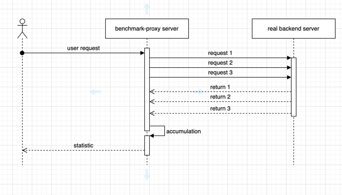

English | [中文](README_ZH.md)

# Overview

A powerful HTTP/HTTPS proxy tool designed for API benchmark testing and performance analysis.

## Key Features

- Full HTTP/HTTPS proxy support
- Comprehensive API benchmark testing capabilities
- Detailed performance metrics tracking (response time, success/error counts)
- Dynamic request data replacement via template tags
- Flexible response validation for both status codes and response bodies

# SSL Certificate Setup (Optional)

For HTTPS support, you can generate self-signed certificates using the following commands:

1. `openssl genrsa -out ca.key 2048`
2. `openssl req -new -x509 -key ca.key -out ca.crt -days 1095`
3. `mv ca.* resources/`
4. Add the generated certificate to your system's trusted certificates

# Usage

Start the proxy server:
```bash
benchmark-proxy --port {port}
```

# Request Example

> curl -x 127.0.0.1:9900 https://www.baidu.com -H 'Benchmark-Proxy-Times:1' -H 'Benchmark-Proxy-Concurrency:1'

# CustomHeaders

| Header                              | Meaning                                                              |
|-------------------------------------|----------------------------------------------------------------------|
| Benchmark-Proxy-Times               | indicate how many times exec in each http request                    |
| Benchmark-Proxy-Duration            | indicate how much second exec in each http requests                  |
| Benchmark-Proxy-Concurrency         | concurrency in running                                               |
| Benchmark-Proxy-Check-Result-Status | indicate the response status to determine whether request is success |
| Benchmark-Proxy-Check-Result-Body   | indicate the response body to determine whether request is success   |

### Response Checker

example :

1. `Benchmark-Proxy-Check-Result-Status: 200` — Success if response status is 200
2. `Benchmark-Proxy-Check-Result-Status: 200,201` — Success if response status is 200 or 201
3. `Benchmark-Proxy-Check-Result-Status: 200-299` — Success if response status is in [200,299]
4. `Benchmark-Proxy-Check-Result-Body: hello world` — Success if response body equals 'hello world'
5. `Benchmark-Proxy-Check-Result-Body: @Contains[success]` — Success if response body contains 'success'
6. `Benchmark-Proxy-Check-Result-Body: @Reg[\w+]` — Success if response body matches regexp `\w+`

**Supported status check expressions:**
- `200` (equal)
- `200,201` (multi-value)
- `200-299` (range)

**Supported body check expressions:**
- `hello world` (equal)
- `@Contains[success]` (contains)
- `@Reg[pattern]` (regexp)

# CustomizeTag
Provide the following label in request data, and the program will replace it with the real value.

**Supported tags and examples:**

| Tag         | Example / Usage                        | Description                                      |
|-------------|----------------------------------------|--------------------------------------------------|
| ${uuid}     | d035581b-53a3-48e5-9461-ba24709f06c9   | Random UUID                                      |
| ${int}      | 77                                     | Random integer                                   |
| ${int:10,20}| 15                                     | Random integer in [10,20]                        |
| ${float}    | 0.94                                   | Random float                                     |
| ${float:1.5,2.5} | 2.01                              | Random float in [1.5,2.5]                        |
| ${string}   | 762edb6805                             | Random string (default 10 chars)                 |
| ${string:8} | 1a2b3c4d                               | Random string of length 8                        |
| ${bool}     | true                                   | Random boolean                                   |
| ${date:2006-01-02} | 2024-05-01                      | Current date with format                         |
| ${timestamp}| 1714550400                             | Current unix timestamp                           |
| ${incr}     | 1                                      | Auto-increment integer (default start 1)         |
| ${incr:100,2}| 100,102,104...                        | Auto-increment from 100, step 2                  |
| ${range:1,5}| 1,2,3,4,5                              | Range auto-increment in [1,5]                    |
| ${list:[a,b,c]} | b                                  | Randomly pick one from list                      |
| ${const:hello}| hello                                | Constant value                                   |

You can use these tags anywhere in your request body, headers, or URL parameters. The program will replace them with generated values for each request.

# Architecture

