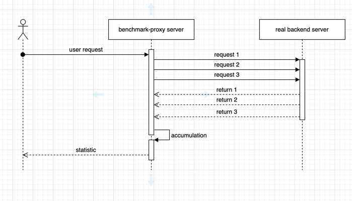

中文 | [English](README.md)

# 简介

benchmark-proxy 是一个用于 HTTP/HTTPS 接口基准测试的代理工具。更具体的，它是:

- 一个 HTTP/HTTPS 代理服务
- 用于API接口基准测试/并发测试
- 能够统计测试接口的请求成功数，失败数，耗时
- 能够采用标签替换方式传递变量数据
- 检查接口返回状态码和数据来判断成功或失败

# 要求

使用该项目，需要生成相关的CA文件

1. `openssl genrsa -out ca.key 2048`
2. `openssl req -new -x509 -key ca.key -out ca.crt -days 1095`
3. 更新系统信任证书

# 运行

> benchmark-proxy --port {port} --ca-crt {file_path} --ca-key {file_path}

# 请求示例

> curl -x 127.0.0.1:9900 http://www.baidu.com -H 'Benchmark-Proxy-Type:'times'' -H 'Benchmark-Proxy-Times:100' -H '
> Benchmark-Proxy-Concurrency:100'

# 自定义Header

| Header                              | Meaning                 |
|-------------------------------------|-------------------------|
| Benchmark-Proxy-Times               | 声明被测接口的请求次数             |
| Benchmark-Proxy-Duration            | 声明被测接口的请求时间（秒）          |
| Benchmark-Proxy-Concurrency         | 声明请求被测接口的并发度（协程数）       |
| Benchmark-Proxy-Check-Result-Status | 声明请求被测接口成功时返回的 HTTP 状态码 |
| Benchmark-Proxy-Check-Result-Body   | 声明请求被测接口成功时返回的 HTTP 数据  |

### 响应校验

example :

1. `Benchmark-Proxy-Check-Result-Status: 200` 声明被测接口返回的 HTTP 响应状态码为 200
2. `Benchmark-Proxy-Check-Result-Body: hello world` 声明被测接口返回的 HTTP 响应数据为 'hello world'
3. `Benchmark-Proxy-Check-Result-Body: @Reg[\w]` 声明被测接口返回的 HTTP 响应数据满足正则表达式 "\w"

# 替换标签

| Tag       | Example                                            |
|-----------|----------------------------------------------------|
| ${uuid}   | d035581b-53a3-48e5-9461-ba24709f06c9               |
| ${int}    | 6331615752200874333                                |
| ${float}  | 0.681078                                           |
| ${string} | 295dfd92fcd9cd9e43cfa5b2b87e806dda83eb3d7dfd97d5ef |
| ${incr}   | 1(默认:1,代理接口每次被请求时都会将该值+1 )                         |

# 架构图

